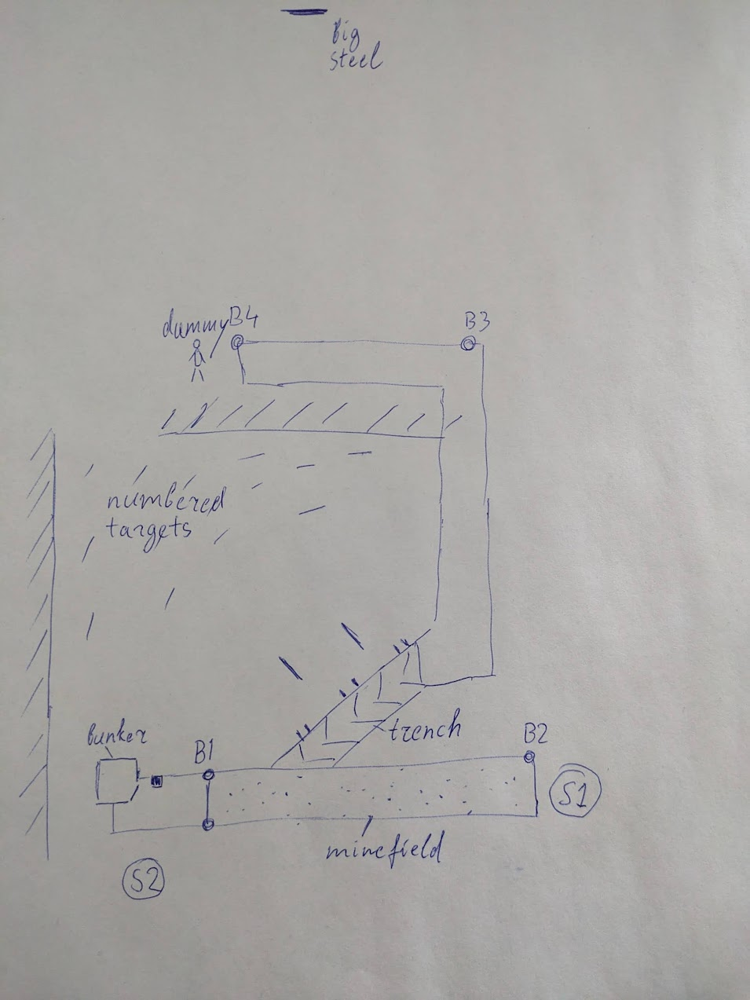

# TOP SECRET

### Description:
You're parachuted behind the enemy lines. You must land, retrieve your rifle you've lost during the landing and take out the guards. Then breach the bunker, retrieve the list of targets and eliminate them while staying hidden. Finally, you must escape after bayonetting enemy general.

### Start
* SKS staged in the dump box (next to the bunker). Empty.
* *If SKS has no bayonet:* A knife (provided) stashed on the shooter in folded state.
* Shooter starts in one of the 2 circle boxes. T-pose, facing up range. Holding SKS mag or stripper clip in one hand, and flashbang (provided) in the other.

### Procedure

1) Starting in far box(1): Spin 10 times in the same direction while staying in the box. Starting in the near box(2): same thing, but spin 20 times.

2) Retrieve SKS and take good cover behind barrel 1. Engage red steel (far side) with two hits. One from right side, right handed. One from left side, left handed.

3) Repeat for barrel 2.

4) Move to the bunker. Dump or sling the SKS. Use flashbang to breach.

5) Find the intel stashed in the bunker. Memorize 6 numbers printed on the back, then hand the intel to RO.

6) Move into the trench and engage numbered paper targets from within trench ports. Two best hits. **ONLY** engage the targets that were noted in the intel. The rest are no-shoots.

7) Moving from the edge of the trench to barrel 3: engage red steel with 5 shots while on the move.

8) Bayonet charge the dummy. Use provided knife if SKS has no bayonet.

9) Barrel 4: repeat the same as barrel 1 and 2.

### Summary
* 1 Steel, 6 paper, 1 dummy
* 23 rounds total

# Layout

